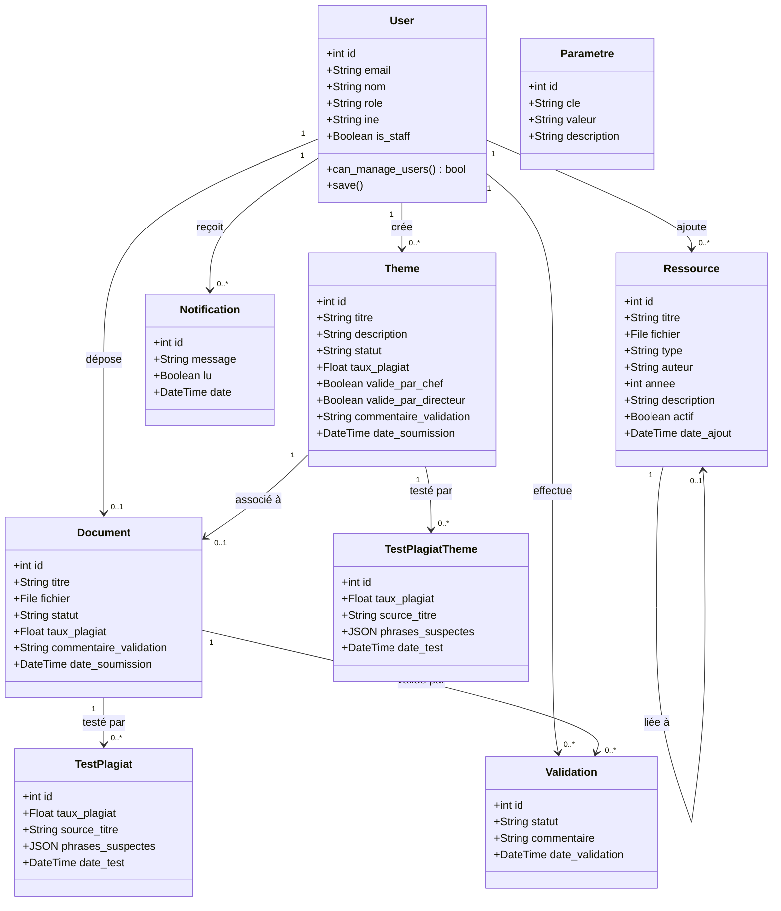
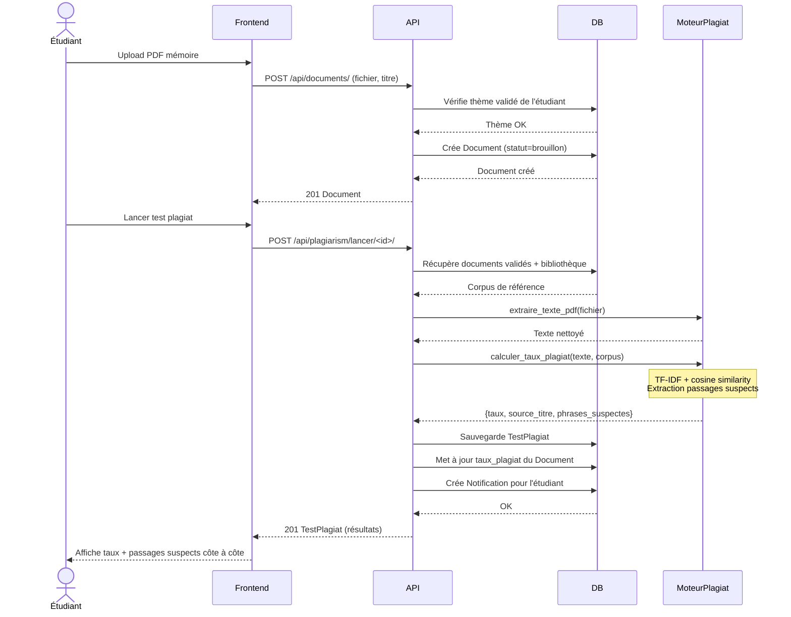
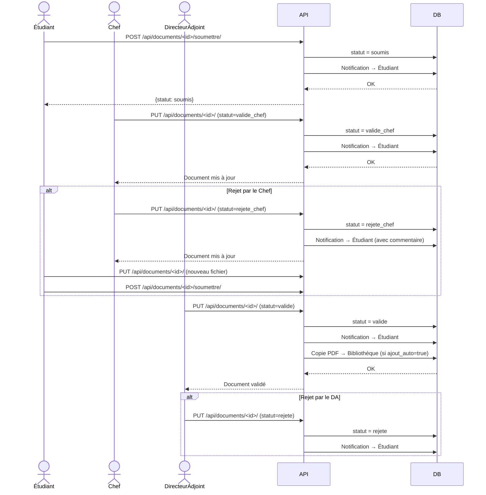
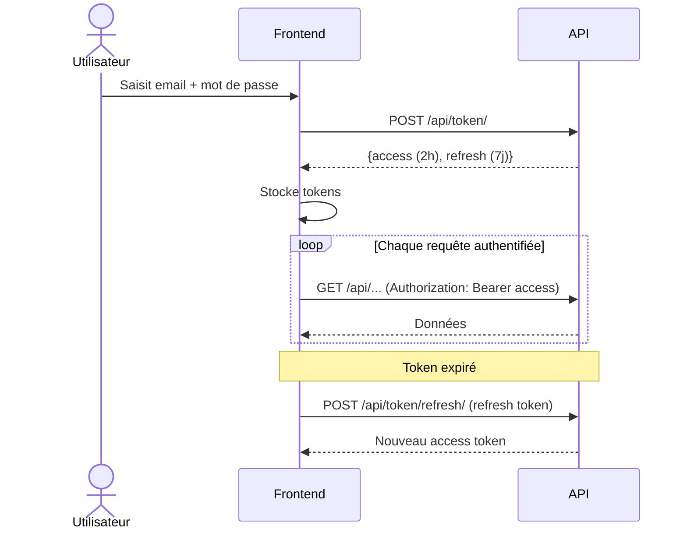
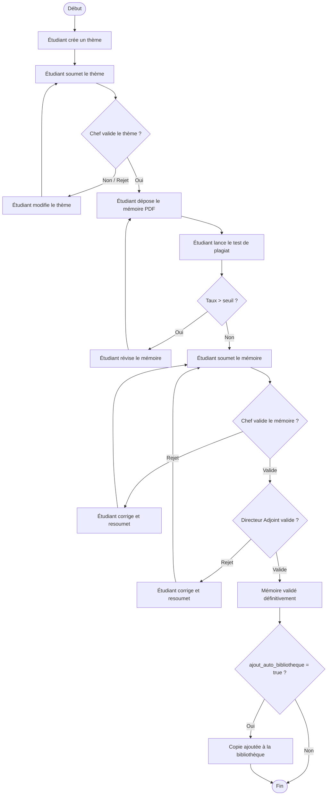
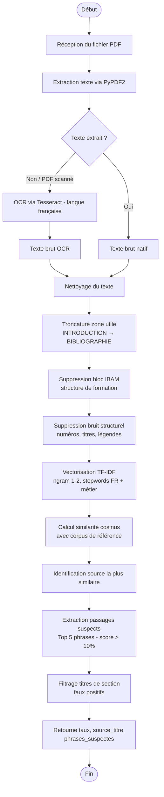
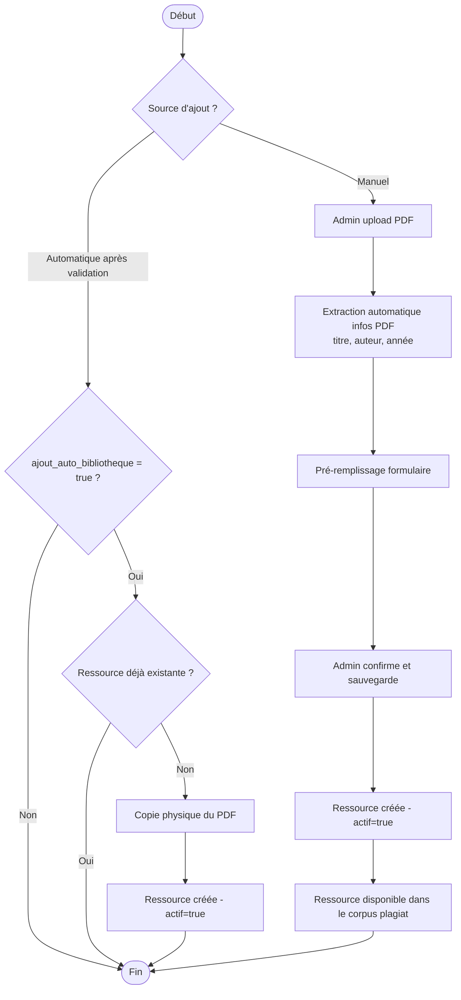

# Diagrammes UML — ScholarCheck

> Tous les diagrammes sont en syntaxe **Mermaid**.  
> Visualisation : VS Code (extension Mermaid Preview), GitHub, ou https://mermaid.live

---

## 1. Diagramme de cas d'utilisation

```mermaid
graph TD
    ETU([Étudiant])
    CHEF([Chef de département])
    DA([Directeur Adjoint])
    SA([Super Admin])

    subgraph Authentification
        UC1[Se connecter]
        UC2[Consulter son profil]
    end

    subgraph Gestion des thèmes
        UC3[Créer un thème]
        UC4[Modifier un thème]
        UC5[Soumettre un thème]
        UC6[Tester le plagiat d'un thème]
        UC7[Valider / Rejeter un thème]
    end

    subgraph Gestion des mémoires
        UC8[Déposer un mémoire PDF]
        UC9[Modifier un mémoire]
        UC10[Soumettre un mémoire]
        UC11[Tester le plagiat d'un mémoire]
        UC12[Valider / Rejeter un mémoire - Chef]
        UC13[Valider / Rejeter un mémoire - DA]
    end

    subgraph Bibliothèque
        UC14[Consulter la bibliothèque]
        UC15[Ajouter une ressource]
        UC16[Activer / Désactiver une ressource]
        UC17[Extraire infos d'un PDF]
    end

    subgraph Administration
        UC18[Gérer les utilisateurs]
        UC19[Configurer les paramètres système]
        UC20[Consulter les notifications]
    end

    ETU --> UC1
    ETU --> UC2
    ETU --> UC3
    ETU --> UC4
    ETU --> UC5
    ETU --> UC6
    ETU --> UC8
    ETU --> UC9
    ETU --> UC10
    ETU --> UC11
    ETU --> UC14
    ETU --> UC20

    CHEF --> UC1
    CHEF --> UC6
    CHEF --> UC7
    CHEF --> UC11
    CHEF --> UC12
    CHEF --> UC14
    CHEF --> UC20

    DA --> UC1
    DA --> UC13
    DA --> UC14
    DA --> UC15
    DA --> UC16
    DA --> UC17
    DA --> UC19
    DA --> UC20

    SA --> UC1
    SA --> UC18
    SA --> UC19
    SA --> UC14
    SA --> UC15
    SA --> UC16
    SA --> UC17
    SA --> UC20
```

---

## 2. Diagramme de classes

---

## 3. Diagramme de séquence — Dépôt et test de plagiat d'un mémoire

---

## 4. Diagramme de séquence — Workflow de validation d'un mémoire

---

## 5. Diagramme de séquence — Authentification JWT

---

## 6. Diagramme d'activité — Processus complet de soumission d'un mémoire

---

## 7. Diagramme d'activité — Moteur de détection de plagiat

---

## 8. Diagramme d'activité — Gestion de la bibliothèque

